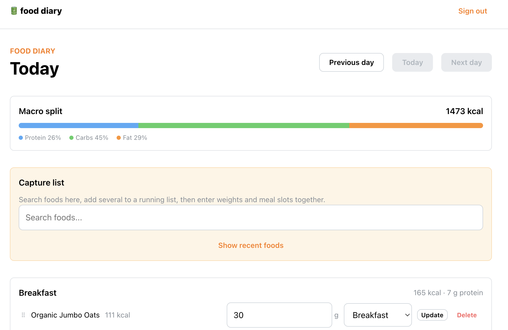

**A simple, private food diary for searching, logging and tracking the day's nutrition...**

Frustrated with the UX on many of the mainstream tracking apps, I made my own!

⚡️ <a href="https://food-tracker-uk.vercel.app/"> <strong>food-tracker-uk.vercel.app</a><strong></strong>

### Features

- Search UK food products using Open Food Facts
- Build a running list of foods to log
- Enter weights and assign meals in one pass
- Track daily calories and macronutrients
- View and edit previous diary entries
- See frequently used foods

### Tech

- TypeScript
- Vite
- Mantine UI
- TanStack Query
- Supabase
- Zod
- Open Food Facts API
- Vitest
